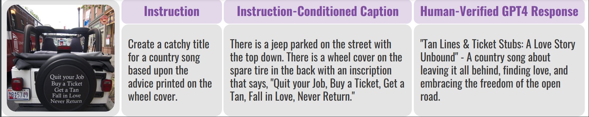

# VisIT-Bench: A Benchmark for Vision-Language Instruction Following Inspired by Real-World Use

[[Paper]](https://arxiv.org/abs/2308.06595) [[Code]](https://github.com/mlfoundations/VisIT-Bench/) [[Dataset]](https://huggingface.co/datasets/mlfoundations/VisIT-Bench) [[Leaderboard]](https://huggingface.co/spaces/mlfoundations/VisIT-Bench-Leaderboard)

This repository contains the official implementation and data for "VisIT-Bench: A Dynamic Benchmark for Evaluating Instruction-Following Vision-and-Language Models". The paper was authored by Yonatan Bitton, Hritik Bansal, Jack Hessel, Rulin Shao, Wanrong Zhu, Anas Awadalla, Josh Gardner, Rohan Taori, and Ludwig Schimdt.



## TLDR

Our work introduces VisIT-Bench, a robust benchmark for diverse real-life vision-language instructions across 70 tasks. We provide a comprehensive evaluation of models' ability to understand human instructions and generate useful, fluent, and safe outputs. Our dataset includes verified reference outputs for all test cases, and we incorporate an ELO-based ranking system for multimodal chatbots. More details can be found in our paper (coming soon).

## Abstract

Recent advances in instruction-following vision-language models have led to a surge in large-scale and accessible multimodal chatbots. 
However, existing works lack a comprehensive evaluation of their capabilities to understand human instructions and provide useful, fluent, and safe outputs. We introduce VisIT-Bench, a robust benchmark for diverse real-life vision-language instructions across 70 tasks, from recognition to reasoning. VisIT-Bench offers in-depth understanding of a model's conversational abilities. Our dataset includes verified reference outputs for all test cases, facilitating automatic comparison with expected responses via a strong large language model (GPT-4). We also incorporate an Elo-based ranking system to establish a leaderboard for 
multimodal chatbots. We source human preference annotations for ranking chatbot responses. Both our Elo-rankings approaches show strong agreement with human evaluations, demonstrating reliability. In our human evaluation, we find that the best-performing instruction-following model wins against the GPT-4 reference in just 27 of the comparisons. VisIT-Bench is dynamic and can integrate and evaluate new models

## Dataset

The dataset consists of 679 instances and 1,578 images, spanning a variety of real-world instruction scenarios. The data was sourced both from newly collected data and existing datasets. It can be accessed at:

- [VisIT-Bench Sheet](https://docs.google.com/spreadsheets/d/1hi8rGXf2WYufkFvGJ2MZ92JNChliM1QEJwZxNboUFlE/edit?usp=sharing)
- [VisIT-Bench Sheet Multi-Images](https://docs.google.com/spreadsheets/d/1IgCjJEd_obCawo1rWYfRZ_J7eiHP_68db5_OaNchKL0/edit?usp=sharing)

### Human Preference Annotations
We are also publishing the human preference annotations in a CSV format, available in [VisIT-Bench Human Preferences](https://github.com/mlfoundations/VisIT-Bench/blob/main/visit_bench_human_preferences.csv).

- `image_url`: URL of the relevant image.
- `instruction`: The question or task based on the image.
- `A` and `B`: Responses generated by two different models.
- `A_model` and `B_model`: Identifiers for the models that generated the responses.
- `model_selection.A` and `model_selection.B`: Boolean flags indicating which model's response aligned more closely with human preference.

These annotations serve to validate and compare the performance of different instruction-following vision-and-language models.

## Leaderboard

The link to our public leaderboard is present [here](https://visit-bench.github.io/).

## How to add new models to the Leaderboard?

1. You can access the single-image and multiple-image datasets above.
2. For every instance (row) in the dataset csv, you would have your model's predictions.
3. Create a `predictions.csv` with 4 mandatory columns `instruction`, `instruction_category`, `image` (single-image case) / `images` (multi-image case), `<model name> prediction`. Here, `<model name>`should be your model name with version if multiple-versions are available. 
4. Send a `prediction.csv` to us on `yonatanbitton1@gmail.com`. 
5. We will use our internal prompting sandbox with reference-free GPT-4 as an evaluator.
6. We will add your model to the leaderboard once we receive all the pairwise judgments from the sandbox.  
7. You will receive a confirmation email as soon as your model has been added to the leaderboard.
8. Estimated time from Step 4-7 would be 1-2 weeks, however, we will try to work on your prediction files as soon as they are sent. 


## Baselines 

We provide the code for most of the instruction-following vision-language models in our paper. Please refer to the baselines [readme](baselines/README.md) for more details. Notably, we provide a single `VisITBaseModel` interface for model generations. 

## License
The new contributions of our dataset (e.g., the instructions, reference outputs, model ranking annotations, etc.) are licensed under the Creative Commons Attribution 4.0 International License (CC BY 4.0).
For the images that were used, please refer to the public license attached to each individual image in the "public_images_metadata" field in the dataset sheets.

## Citation
```
@misc{bitton2023visitbench,
      title={VisIT-Bench: A Benchmark for Vision-Language Instruction Following Inspired by Real-World Use}, 
      author={Yonatan Bitton and Hritik Bansal and Jack Hessel and Rulin Shao and Wanrong Zhu and Anas Awadalla and Josh Gardner and Rohan Taori and Ludwig Schimdt},
      year={2023},
      eprint={2308.06595},
      archivePrefix={arXiv},
      primaryClass={cs.CL}
}
```
Users of VisIT-Bench should also cite the original datasets.
